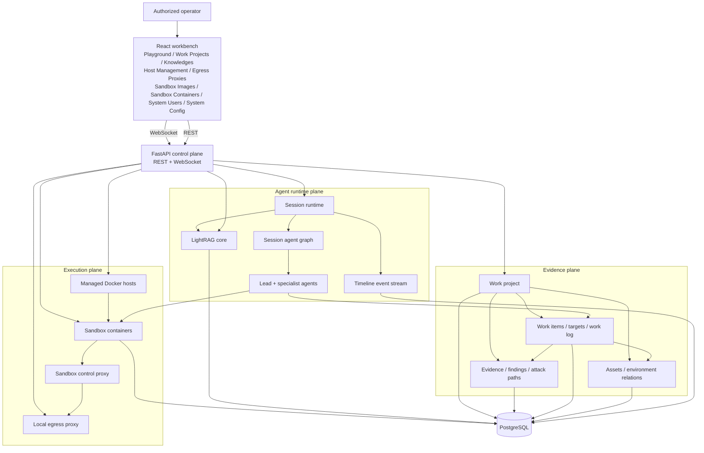
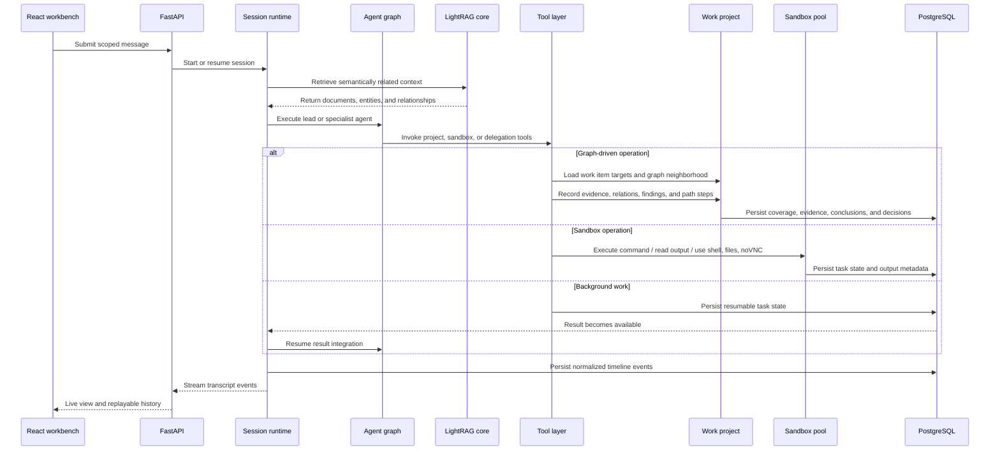
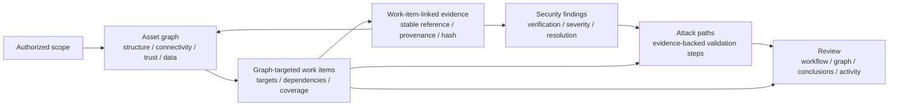
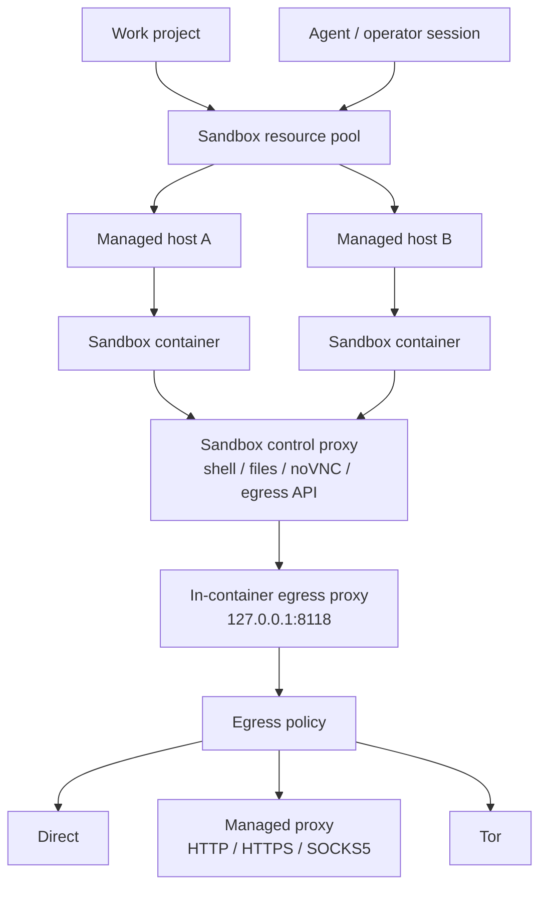

<p align="center">
  
</p>

<p align="center">
  <a href="#architecture">Architecture</a> ·
  <a href="#runtime-flow">Runtime Flow</a> ·
  <a href="#evidence-model">Evidence Model</a> ·
  <a href="#sandbox-and-egress">Sandbox and Egress</a> ·
  <a href="#non-destructive-design-constraints">Non-destructive Design Constraints</a> ·
  <a href="https://yv1ing.github.io/Z3r0/en/">Documentation</a> ·
  <a href="https://yv1ing.github.io/Z3r0/en/guide/quick-start">Quick Start</a>
</p>

<p align="center">
  <strong>Open-source multi-agent security assessment workbench for intelligent, operator-guided automation of authorized penetration testing, vulnerability discovery, code auditing, and technical research.</strong>
</p>

---

> :warning: **Security and Legal Notice**
>
> Z3r0 assumes that user-provided objectives, targets, and instructions are lawfully authorized for the active engagement. It grants no additional access rights; the active `WorkProject` scope and runtime controls define execution boundaries.
>
> Operators remain responsible for deployment, conduct, and compliance with applicable law and contracts. The author and maintainers accept no responsibility for damage, loss, claims, or liability arising from user deployment, configuration, instructions, conduct, or misuse.
>
> See [Non-destructive Design Constraints](#non-destructive-design-constraints) for the operating requirements.

## Overview

Z3r0 is a control-plane-oriented, multi-agent security assessment workbench for intelligent, operator-guided automation of authorized penetration testing, vulnerability discovery, code auditing, and technical research. It combines a React operator console, a FastAPI management plane, a session-based agent runtime, project-scoped evidence records, distributed Docker sandbox resources, and a controlled egress layer.

Z3r0 brings authorized scope, asset relationships, specialist assignments, evidence, findings, attack paths, workflow decisions, sandbox resources, and session timelines into one shared workspace. Security teams can coordinate approved activities, follow assessment progress, trace conclusions to supporting material, and review the complete engagement without reconstructing state from separate conversations and tools.

## Architecture



Z3r0 separates the system into four architectural planes:

| plane | scope |
| --- | --- |
| control plane | Users, system configuration, agents, sessions, work projects, knowledge collections, managed hosts, sandbox images, sandbox containers, and egress proxies. |
| runtime plane | Multi-agent session execution, task-input LightRAG retrieval, live event streaming, long-running task continuity, history projection, and timeline replay. |
| evidence plane | Authorized scope, asset relationships, graph-targeted work items, immutable evidence, findings, attack paths, target coverage, and workflow decisions. |
| execution plane | Docker hosts, sandbox containers, shell/file/noVNC access, command execution, sandbox-local skills, built-in security tooling, and outbound network policy. |

This separation is reflected in the repository structure: routers and handlers expose application contracts, services own domain behavior, models define persistent state, and the React workbench consumes the stable REST/WebSocket surface.

## Runtime Flow




## Evidence Model



`WorkProject` provides a durable workspace for each assessment. Operators can explore the authorized environment as an asset graph, assign specialists to specific assets and test surfaces, review the evidence produced by each assignment, and follow validated attack paths. Findings and path conclusions remain connected to their supporting material, giving the team a coherent record from initial scope through review and retesting.

| data object | role in the assessment |
| --- | --- |
| `WorkProject` | Assessment boundary for owners, authorized scope, sandbox bindings, sessions, workflow, and closure. |
| `Asset` | Canonically identified network, host, domain, service, application, endpoint, repository, component, artifact, identity, data store, or cloud resource. |
| `Relation` | Directed link between two assets describing structure, connectivity, dependency, identity, data flow, or provenance. |
| `WorkItem` | Coordinated unit of work with an assigned specialist, targets, dependencies, scope, completion criteria, and review result. |
| `WorkItemTarget` | Asset and test surface tracked through a coverage conclusion or deferral. |
| `WorkItemDependency` | Ordering relationship between two work items. |
| `Evidence` | Work-item-linked observation with a source reference and lifecycle status. |
| `Finding` | Security conclusion with category, verification, severity, impact, recommendation, and optional CWE/CVSS data. |
| `AttackPath` | Ordered path from an entry asset to a target asset, composed of linked validation steps. |
| `AttackPathStep` | One action between two assets with a status, result, and supporting evidence. |
| `WorkLog` | Significant work item event, such as a decision, blocker, handoff, or result. |

The workbench gives operators a unified view of scope coverage, current assignments, blocked test surfaces, review queues, validated findings, attack paths, evidence, and specialist activity. Leads can review completed work, return specific target surfaces for further validation, and use focused search and filters to move quickly from project-level posture to the relevant asset, assignment, evidence chain, or security conclusion.

## Sandbox and Egress



Sandbox resources are managed infrastructure. Administrators manage Docker hosts, sandbox images, running containers, exposed ports, and project bindings. Operators and agents work through selected running containers, and the same sandbox boundary supports command execution, shell sessions, file management, browser/noVNC review, and sandbox-local skills.

The default sandbox image groups targeted DNS, HTTP, and service diagnostics with local artifact triage, Android and firmware analysis, reverse engineering, browser automation, and Python workflows behind sandbox-local skills. Use every tool only against supplied artifacts or explicitly approved assessment targets.

Outbound traffic is normalized through a container-level egress profile. The sandbox runtime exports proxy environment variables to a local proxy inside the container; the control plane can set the container to direct access, a managed proxy, or Tor. Managed proxies use HTTP, HTTPS, or SOCKS5 upstreams. This gives the platform a unified place to manage network identity, traffic routing, and operator-environment isolation.

## Technical Highlights

| highlight | description |
| --- | --- |
| multi-agent runtime | Lead and specialist agents coordinate graph-targeted work items under operator review. |
| evidence-driven workflow | Work projects connect authorized scope, asset relations, findings, attack paths, evidence, and retesting. |
| retrieval and replay | LightRAG supplies task context, while normalized events support live streaming and historical replay. |
| managed execution | Docker hosts and sandbox containers provide isolated workspaces with project-bound resources. |
| controlled egress | Container traffic follows a platform-managed direct, proxy, or Tor policy; proxy upstreams use HTTP, HTTPS, or SOCKS5. |

## Expert Team

| code | name | role | responsibilities |
| --- | --- | --- | --- |
| `cso` | Z3r0 | Chief Security Officer | Task decomposition, team coordination, result integration |
| `cae` | V3ra | Chief Audit Engineer | Source code auditing, dependency review, remediation verification |
| `cie` | L1ly | Chief Intelligence Engineer | Intelligence gathering, asset discovery, relationship mapping |
| `cpe` | Fr4nk | Chief Penetration Engineer | Authorized testing, vulnerability validation, impact confirmation |
| `cre` | J4m3 | Chief Reverse Engineer | Reverse analysis, firmware disassembly, binary unpacking |
| `cce` | Nu1L | Chief Cryptography Engineer | Cryptographic analysis, key review, security assessment |

## Repository Layout

```text
core/        Agent specs, runtime, task runtime, delegation, context, tools
service/     Domain services for agents, knowledge, sandbox, users, hosts, egress, projects
router/      FastAPI route declarations
handler/     HTTP and WebSocket request handling
model/       SQLModel database models
schema/      Pydantic API contracts
web/         React workbench and landing page
sandbox/     Docker sandbox image and control proxy
docs/        VitePress documentation
.z3r0/       Runtime configuration, agent prompts, logs
.lightrag/   Temporary LightRAG parser inputs and local working files
```

## Documentation

- [Overview](https://yv1ing.github.io/Z3r0/en/guide/overview)
- [Quick Start](https://yv1ing.github.io/Z3r0/en/guide/quick-start)
- [First Use](https://yv1ing.github.io/Z3r0/en/guide/first-use)
- [Community](https://yv1ing.github.io/Z3r0/en/guide/community)

## Acknowledgments

Thanks to the [Linux.do](https://linux.do/) website and its community for their support in project development and communication.

## Non-destructive Design Constraints

Z3r0 assumes user-provided work is authorized and applies bounded, reversible operating limits to every `WorkItem`, agent, sandbox, host, identity, and egress path:

- **Scope:** Bind each action to a declared in-scope asset, an active `WorkItem`, and an approved method. Keep unconfirmed discoveries contextual.
- **Execution:** Prefer read-only checks, least-privilege identities, synthetic or canary data, conservative rates, bounded concurrency, and explicit time, retry, payload, and resource limits.
- **Impact:** Do not materially damage, degrade, or interrupt a target or make unapproved changes to its systems or data. Do not deploy malware, establish persistence, obtain unauthorized privileges, move laterally, exfiltrate data, perform destructive writes, or exhaust service resources. Any approved write must be minimal, reversible, and assigned a cleanup owner.
- **Proof and recovery:** Use the narrowest reversible check and stop once the condition is established. Monitor target health, retain only necessary redacted evidence, and record rollback or cleanup. If a limit cannot be met, block the path and replan before continuing.

Isolation and egress controls reduce operational risk but do not expand the active project scope. Apply the runtime flags and operator decisions that govern each action.

## License

This project is licensed under the [MIT License](LICENSE).

## Star History

<a href="https://www.star-history.com/?repos=yv1ing%2FZ3r0&type=date&legend=top-left">
 <picture>
   <source media="(prefers-color-scheme: dark)" srcset="https://api.star-history.com/chart?repos=yv1ing/Z3r0&type=date&theme=dark&legend=top-left&sealed_token=RN0abSf855BePOEmL59e0_3n0YNDKD7dv3YlNcCsCAQv2bCz3UEFtxcnM6pt2l_7PDeTINHHEaGJtf3PMbTJSs2rGE7ruvJKT6s0tFpFz588h9_ZogUu4XPVByE_gHQOsVy1a5xePtlj3byoP9YmQaybaeuPDNU-jMZDLf_jgmr06wzD6VdL0zHD4HB7" />
   <source media="(prefers-color-scheme: light)" srcset="https://api.star-history.com/chart?repos=yv1ing/Z3r0&type=date&legend=top-left&sealed_token=RN0abSf855BePOEmL59e0_3n0YNDKD7dv3YlNcCsCAQv2bCz3UEFtxcnM6pt2l_7PDeTINHHEaGJtf3PMbTJSs2rGE7ruvJKT6s0tFpFz588h9_ZogUu4XPVByE_gHQOsVy1a5xePtlj3byoP9YmQaybaeuPDNU-jMZDLf_jgmr06wzD6VdL0zHD4HB7" />
   
 </picture>
</a>
