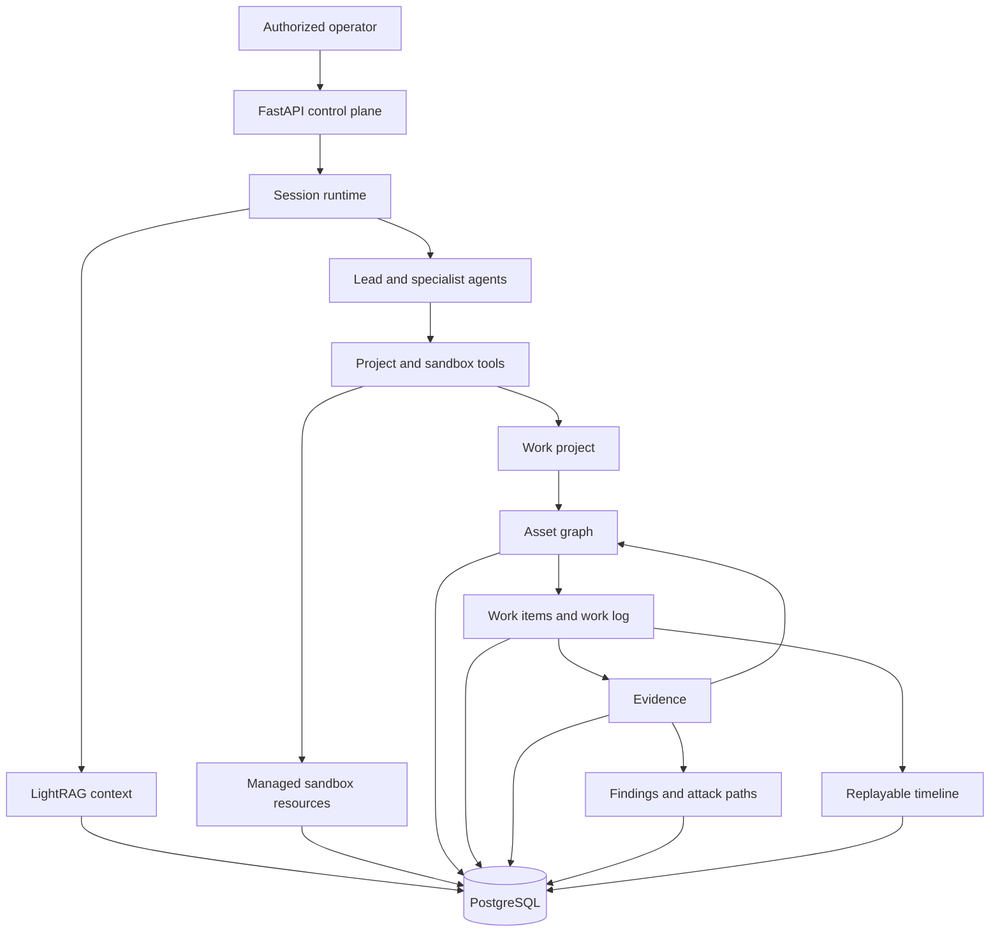
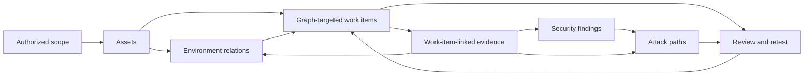
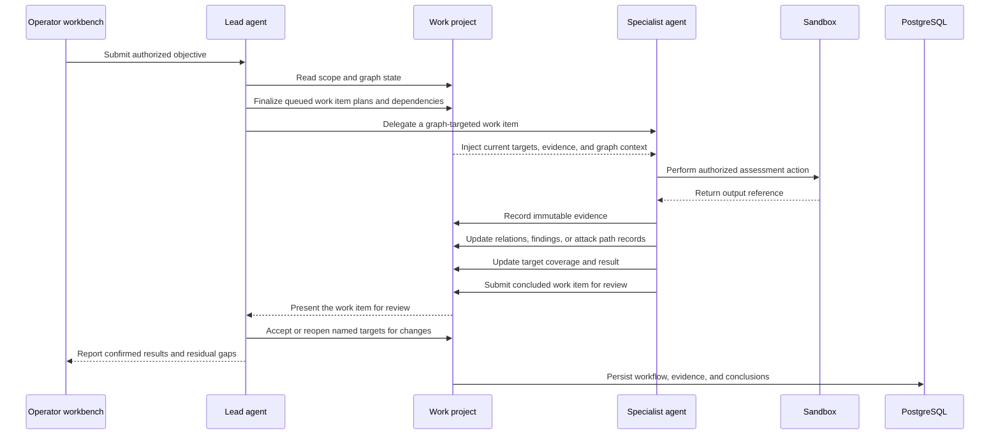

# Overview

Z3r0 is an open-source multi-agent security assessment workbench for intelligent, operator-guided automation of authorized penetration testing, vulnerability discovery, code auditing, reverse engineering, cryptographic review, and controlled technical research.

The platform follows a specialist operating model: a lead agent governs scope, decomposes graph-targeted work items, coordinates specialist agents, reviews evidence-backed outputs, and closes the engagement. The project record remains useful beyond the conversation because scope, environment relationships, workflow decisions, evidence, findings, and attack paths are retained as explicit application data.

> :warning: Security and Legal Notice
>
> Z3r0 assumes that user-provided objectives, targets, and instructions are lawfully authorized for the active engagement. It grants no additional access rights; the active `WorkProject` scope and runtime controls define execution boundaries.
>
> Operators remain responsible for deployment, conduct, and compliance with applicable law and contracts. The author and maintainers accept no responsibility for damage, loss, claims, or liability arising from user deployment, configuration, instructions, conduct, or misuse.
>
> Keep actions bounded and non-destructive. The technical controls below apply to every work item, agent, sandbox, host, identity, and egress path.

## Non-destructive Operation

Safety is a technical acceptance criterion for every `WorkItem`. Apply these controls during planning, execution, and review:

| control | requirement |
| --- | --- |
| scope gate | Tie each action to a declared in-scope asset, an active `WorkItem`, and an approved method. Treat newly discovered assets as contextual until the lead agent confirms scope. |
| impact ceiling | Do not materially damage, degrade, or interrupt a target, or make unapproved changes to its systems or data. Do not deploy malware, establish persistence, obtain or retain unauthorized privileges, move laterally, exfiltrate data, perform destructive writes, or exhaust service resources. |
| execution limits | Prefer passive or read-only checks, least-privilege identities, synthetic or canary data, small reviewed inputs, conservative rates, bounded concurrency, and explicit time, retry, payload, and resource limits. |
| proof threshold | Use the narrowest reversible action that can establish or refute the security condition. Stop when the condition is demonstrated; a complete compromise or weaponized proof is out of scope. |
| data handling | Collect only the evidence needed for the conclusion. Redact credentials, personal data, and unrelated content, and preserve provenance, integrity, and cleanup status. |
| stop and recovery | Halt on unexpected state changes, instability, third-party involvement, sensitive-data exposure, or a breached limit. Record the blocker, notify the owner, and complete the approved rollback or cleanup. |

Isolation and egress controls reduce operational risk but do not expand the active project scope. If validation would exceed a limit, block the path and replan before continuing. See [Quick Start](./quick-start) and [First Use](./first-use#operation-limits) for deployment and workflow checks.

## Core Capabilities

| capability | description |
| --- | --- |
| multi-agent orchestration | A lead agent assigns work items to asset intelligence, security assessment, code audit, reverse engineering, and cryptography specialists. |
| graph-driven workflow | Each work item identifies in-scope assets, test surfaces, dependencies, completion criteria, and an optional relation, finding, or attack path focus. |
| durable evidence chain | Immutable evidence references command output, HTTP exchanges, code locations, artifacts, external sources, and useful negative results. |
| findings and attack paths | Findings separate verification from resolution; attack paths retain continuous, evidence-backed steps from an entry condition to an affected target. |
| replayable runtime | Normalized session events support live streaming, interruption, long-running work, recovery, and historical replay. |
| controlled execution | Managed Docker sandboxes provide shell, files, browser/noVNC, skills, preloaded tooling, and container-level egress policy. |
| retrieval context | LightRAG provides matching source chunks and knowledge-graph context for task-oriented inputs. |
| operator workbench | `Overview`, `Workflow`, `Graph`, `Assets`, `Findings`, `Attack Paths`, `Evidence`, and `Activity` views support professional review. |

## Architecture

The control plane manages identities, projects, sessions, knowledge collections, execution resources, and outbound policy. Specialists receive assigned work items together with the relevant project and graph context. The evidence plane distinguishes environment facts from validation actions: relations describe structure, connectivity, dependencies, identity, trust, data flow, and provenance; attack path steps document bounded checks, observed transitions, and their supporting evidence. PostgreSQL retains the shared operating record and session timeline.

## Work Project Model

Assets give the team a stable inventory of in-scope, contextual, and out-of-scope entities. Work items turn the graph into coordinated assignments by connecting specialists, target assets, test surfaces, dependencies, and review outcomes. Each specialist receives the current project context needed for its assignment, while evidence keeps observations attributable and traceable to source material. Findings bring together verification, impact, recommendation, CWE/CVSS, and affected assets; attack paths document demonstrated transitions and control outcomes.

## Runtime Sequence

New assets, credentials, trust relationships, code paths, versions, keys, and routes surface retest opportunities. Blocked assignments, deferred or suspected findings, and open path hypotheses remain visible with the surrounding graph and evidence. Search and structured filters provide direct access to the relevant workflow, asset, finding, and evidence records during review.

## Expert Team

| code | name | role | responsibilities |
| --- | --- | --- | --- |
| `cso` | Z3r0 | Chief Security Officer | Scope governance, work item planning, coordination, review, and closure |
| `cae` | V3ra | Chief Audit Engineer | Source review, dependency analysis, vulnerability tracing, and remediation review |
| `cie` | L1ly | Chief Intelligence Engineer | Asset discovery, ownership correlation, exposure analysis, and relationship mapping |
| `cpe` | Fr4nk | Chief Penetration Engineer | Authorized live testing, vulnerability validation, bounded impact analysis, and confirmation |
| `cre` | J4m3 | Chief Reverse Engineer | Binary, firmware, mobile, protocol, and artifact analysis |
| `cce` | Nu1L | Chief Cryptography Engineer | Protocol, primitive, certificate, token, and key-management review |
