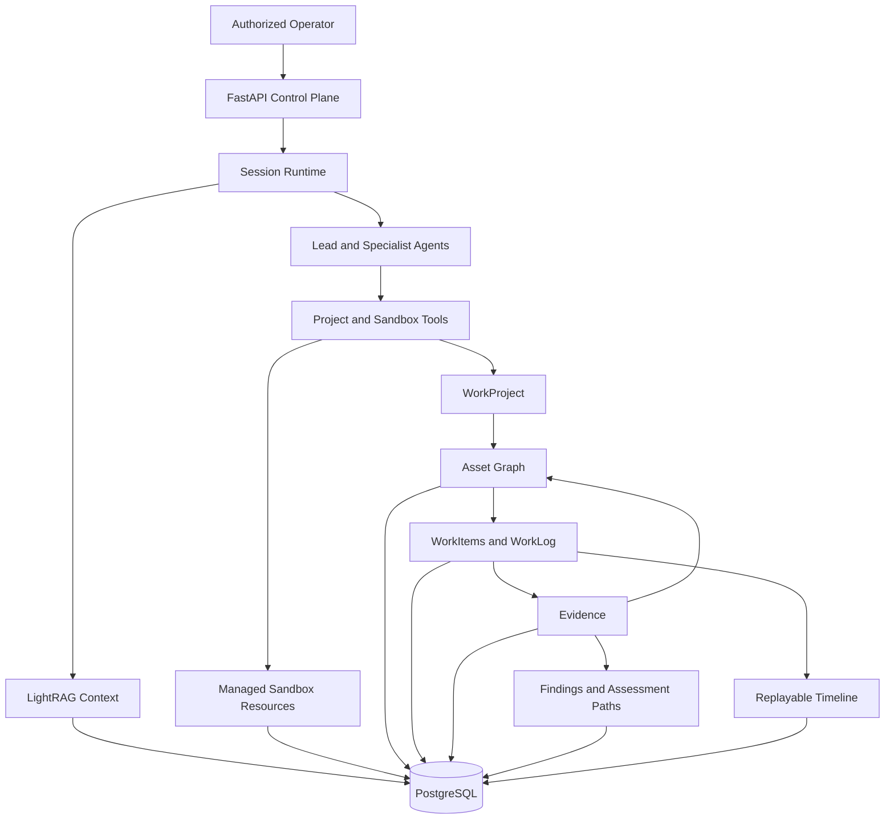
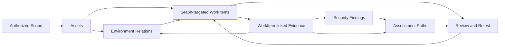
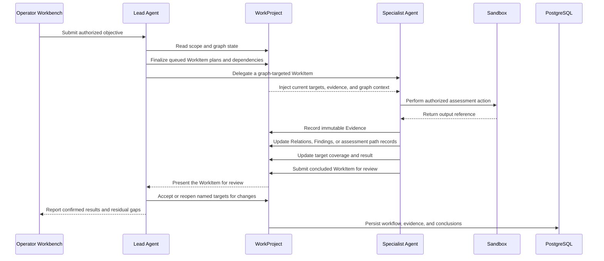

# Overview

Z3r0 is an open-source security assessment collaboration workbench for authorized testing, vulnerability analysis, code auditing, reverse engineering, cryptographic review, and controlled technical research.

The platform follows a specialist operating model: a lead Agent governs scope, decomposes graph-targeted WorkItems, coordinates specialist Agents, reviews evidence-backed outputs, and closes the engagement. The project record remains useful beyond the conversation because scope, environment relationships, workflow decisions, evidence, findings, and assessment paths are retained as explicit application data.

> :warning: Security and Legal Notice
>
> Use Z3r0 only for lawful security assessment, risk analysis, code auditing, or technical research within a documented scope and with prior written authorization from the system owner or engagement authority defining permitted assets, methods, timing, data handling, monitoring, stop conditions, and cleanup.
>
> Z3r0 grants no access rights or testing authority. Any unauthorized, unlawful, or malicious attack, intrusion, compromise, disruption, or data activity is strictly prohibited. Do not exceed scope, bypass safeguards, or collect or alter data without approval; obtain separate approval for production systems, personal data, credentials, and third-party services, and stop when authorization, ownership, scope, or safety is unclear.
>
> **Users bear sole responsibility for deployment, conduct, and compliance with applicable law and contractual requirements. The author and maintainers accept no responsibility for any damage, loss, claim, or legal liability arising from user deployment, configuration, instructions, conduct, or unauthorized use.**

## Core Capabilities

| Capability | Description |
| --- | --- |
| Multi-Agent orchestration | A lead Agent assigns WorkItems to asset intelligence, security assessment, code audit, reverse engineering, and cryptography specialists. |
| Graph-driven workflow | Each WorkItem identifies in-scope assets, test surfaces, dependencies, completion criteria, and an optional relation, finding, or assessment-path focus. |
| Durable evidence chain | Immutable Evidence references command output, HTTP exchanges, code locations, artifacts, external sources, and useful negative results. |
| Findings and assessment paths | Findings separate validation from disposition; assessment paths retain continuous, evidence-backed steps from an observed entry condition to an affected target. |
| Replayable runtime | Normalized session events support live streaming, interruption, long-running work, recovery, and historical replay. |
| Controlled execution | Managed Docker sandboxes provide shell, files, browser/noVNC, skills, preloaded tooling, and container-level egress policy. |
| Retrieval context | LightRAG provides matching source chunks and knowledge-graph context for task-oriented inputs. |
| Operator workbench | Overview, Workflow, Graph, Assets, Findings, Assessment Paths, Evidence, and Activity views support professional review. |

## Architecture

The control plane manages identities, projects, sessions, knowledge collections, execution resources, and outbound policy. Specialists receive assigned WorkItems together with the relevant project and graph context. The evidence plane distinguishes environment facts from validation actions: Relations describe structure, connectivity, dependencies, identity, trust, data flow, and provenance; assessment-path steps document bounded checks, observed transitions, and their supporting evidence. PostgreSQL retains the shared operating record and session timeline.

## WorkProject Model

Assets give the team a stable inventory of in-scope, contextual, and out-of-scope entities. WorkItems turn the graph into coordinated assignments by connecting specialists, target assets, test surfaces, dependencies, and review outcomes. Each specialist receives the current project context needed for its assignment, while Evidence keeps observations attributable and traceable to source material. Findings bring together validation, impact, remediation, CWE/CVSS, and affected assets; assessment paths document demonstrated transitions and control outcomes with an optional behavior taxonomy.

## Runtime Sequence

New assets, credentials, trust relationships, code paths, versions, keys, and routes surface retest opportunities. Blocked assignments, deferred or suspected Findings, and open path hypotheses remain visible with the surrounding graph and evidence. Search and structured filters provide direct access to the relevant workflow, asset, Finding, and Evidence records during review.

## Expert Team

| Code | Name | Role | Responsibilities |
| --- | --- | --- | --- |
| `cso` | Z3r0 | Chief Security Lead | Scope governance, WorkItem planning, coordination, review, and closure |
| `cae` | V3ra | Code Audit Engineer | Source review, dependency analysis, vulnerability tracing, and remediation review |
| `cie` | L1ly | Intelligence Engineer | Asset discovery, ownership correlation, exposure analysis, and relationship mapping |
| `cpe` | Fr4nk | Chief Penetration Engineer | Authorized live testing, vulnerability validation, bounded impact analysis, and confirmation |
| `cre` | J4m3 | Reverse Engineer | Binary, firmware, mobile, protocol, and artifact analysis |
| `cce` | Nu1L | Cryptography Engineer | Protocol, primitive, certificate, token, and key-management review |
